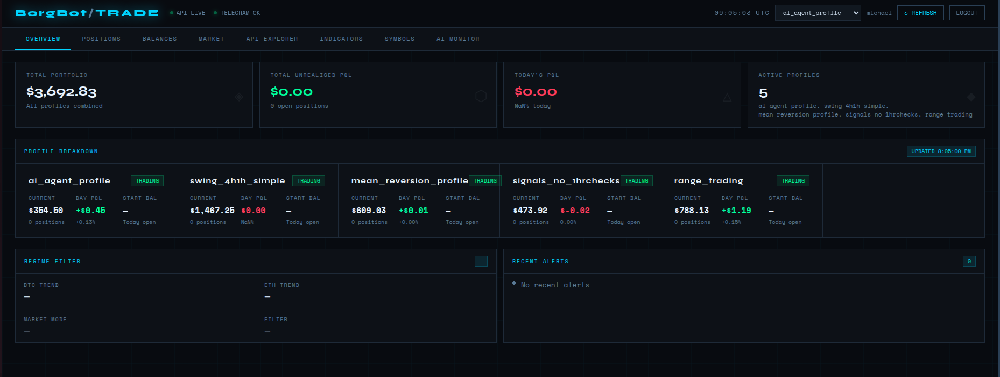

# 🤖 Crypto Algo Trading Bot

A Python-based algorithmic cryptocurrency trading system with multi-strategy support, AI-assisted signal generation, and a web-based management UI. Built for auto-deployment on [Render](https://render.com) with PostgreSQL persistence via [Neon](https://neon.tech).

---

## Overview

This bot monitors cryptocurrency pairs in real time, evaluates configurable technical indicator pipelines, and executes trades on the [Backpack Exchange](https://backpack.exchange) via its API. Each trading strategy is encapsulated as a fully database-driven **Trading Profile**, allowing multiple strategies to run simultaneously — each with their own indicators, risk parameters, and timeframes.

A shadow **AI Agent** profile is also in development, using the Claude API to evaluate market conditions and compare its decisions against the rule-based indicators system over time.

---
## Features

- **Multi-profile trading** — run multiple independent strategies simultaneously (I.e. Mean reversion, trend following, short term, long term, etc)
- **Multi-timeframe analysis** — higher timeframe trend filter + lower timeframe entry timing
- **Configurable indicator pipelines** — per-profile indicators stored in PostgreSQL with full CRUD support
- **Risk management** — per-profile TP/SL, trailing stops, position sizing, max exposure limits
- **Circuit breakers** — daily profit/loss limits with configurable lock-out periods
- **Backtesting engine** — replays indicator logic against historical candles to compare profile variants
- **AI Agent (in development)** — shadow mode using Claude API; logs AI vs rules-based decisions for performance comparison
- **Web management UI** — profile and indicator CRUD, trade history, position monitoring
- **Schema versioning** — Alembic manages all database migrations
- **Auto-deploy** — pushes to GitHub trigger automatic deployment via Render
- **Webhook endpoints** - Hosted Webhook endpoints to receive trend analysis data from Trading view every 2 minutes
- **Telegram alerting** - trade status, health Updates, alerting all sent via telegram, along with interactive updates at user request (via telegram message)

---
## Web interface



---

## Tech Stack

| Layer | Technology |
|---|---|
| Language | Python |
| Database | PostgreSQL (hosted on [Neon](https://neon.tech)) |
| ORM | SQLAlchemy |
| Migrations | Alembic |
| Exchange | Backpack Exchange API |
| AI Integration | Anthropic Claude API |
| Deployment | Render (serverless, auto-deploy from GitHub) |
| Frontend | Vanilla HTML/JS management UI |

---

## Architecture

```
┌─────────────────────────────────────────────────────┐
│                    API Server                        │
│          (Profile & Indicator Management)            │
└──────────────────────┬──────────────────────────────┘
                       │
          ┌────────────▼────────────┐
          │    Monitoring Service   │
          │  (Position & Trade Mgmt)│
          └────────────┬────────────┘
                       │
          ┌────────────▼────────────┐
          │    Signal Generator     │
          │  (Profile Dispatcher)   │
          └────────────┬────────────┘
                       │
     ┌─────────────────┼─────────────────┐
     │                 │                 │
┌────▼─────┐   ┌───────▼──────┐  ┌──────▼──────┐
│Trend Cache│   │Regime Filter │  │AI Signal    │
│(Indicators│   │(Market State)│  │Handler      │
│& Signals) │   └──────────────┘  │(Claude API) │
└──────────┘                      └─────────────┘
     │
┌────▼──────────────────────────────┐
│         PostgreSQL (Neon)         │
│  Profiles · Indicators · Trades   │
│  Positions · AI Signal Logs       │
└───────────────────────────────────┘
```

### Core Modules

| Module | Responsibility |
|---|---|
| `trend_cache.py` | Core indicator evaluation engine; multi-timeframe signal generation |
| `signal_generator.py` | Caches a single `TradingService` instance; dispatches signals per profile |
| `monitoring_service.py` | Tracks open positions; executes TP/SL/trailing stop logic |
| `regime_filter.py` | Classifies broader market regime (trending, ranging, choppy) |
| `ai_signal_handler.py` | Sends market context to Claude API; logs AI vs rule-based decisions |
| `backtest_engine.py` | Replays indicator logic on historical candles for strategy comparison |
| `api_server.py` | REST API for profile/indicator CRUD and management UI |
| `models.py` | SQLAlchemy ORM models for all database entities |

---

## Trading Profiles & Strategies

All profiles are database-driven. Each profile defines its own indicators (nested under a `params` key), risk parameters, and timeframes. Five profiles are currently active:

### 1 & 2 — Trend Following (Variants A & B)
Two variants with differing indicator triggers for A/B comparison.
- **Timeframes:** 60m trend filter + 15m entry timing
- **Key indicators:** EMA slope, RSI gating with dual entry paths (`rsi_reversal_momentum` and `rsi_range`), volume ratio, `lookback_candles` for post-peak cooling entries

### 3 — Mean Reversion
- **Timeframes:** 15m only
- Designed to enter against short-term overextension

### 4 — Range Trading
Built for choppy, non-trending markets.
- **Timeframes:** 60m regime filter + 15m entry timing
- **Reversal candle patterns supported:**
  - *Single-candle:* `hammer`, `doji`, `bull_close`
  - *Two-candle:* `higher_low`, `engulfing`
- `max_drop_from_close_pct` guard blocks entries when live price has fallen too far from the prior candle close

### 5 — 4hr Swing Trading
Built for larger TP/SL allowances and longer timeframe reversals.
- **Timeframes:** 240m trend filter + 60m entry timing

### Pairs Traded 
`SOL_USDC` · `ETH_USDC` · `HYPE_USDC` · `SUI_USDC` · `BTC_USDC`

---

## AI Agent (In Development)

A shadow AI profile runs (Paper trading only currently) the Claude API in parallel with the rule-based system on every signal evaluation. The AI receives a structured context snapshot (trend state, indicator values, regime classification) and returns an `ENTER / SKIP / WAIT` decision with confidence score, reasoning, and suggested risk levels.

All decisions are logged to `ai_signal_log` alongside the simultaneous rule-based decision. Once a position resolves, `OutcomeResolver` fills in the trade result — enabling an ongoing quantitative comparison between the two systems in `ai_vs_rules_stats`.

Data is reviewed regularly once adequate trades have been completed, and prompt will be regularly adjusted until AI winrate exceeds rules based winrate.
Will then activate AI trading on 1 profile

---

## Risk Management

Each profile supports independent configuration of:

- Take profit / stop loss percentages
- Trailing stops (with arming threshold)
- Max open positions
- Max portfolio exposure %
- Minimum signal confidence threshold
- Signal cooldown period
- **Circuit breakers** — daily profit cap + daily loss cap, each with configurable lock-out duration

---

## Backtesting

The backtesting engine (`backtest_engine.py` / `run_backtest.py`) replays the same indicator logic used in live trading against historical candle data. This allows quick iteration on indicator parameters and comparison of profile variants without live capital at risk.

---

## Database Schema

Schema is managed entirely via Alembic — no manual DB changes. Key tables:

| Table | Purpose |
|---|---|
| `trading_profiles` | Profile configuration and risk parameters |
| `symbol_configs` | Trade size/limits per symbol per profile |
| `indicators` | Per-profile indicators with JSON `params` |
| `trades` | All executed trades with reason metadata |
| `positions` | Open and closed positions with P&L |
| `circuit_breaker_config` | Per-profile daily limit configuration |
| `circuit_breaker_events` | Triggered circuit breaker log |
| `daily_balance_snapshots` | Tracks open/close/profit per day per profile |
| `ai_signal_log` | AI vs rule-based decision log |
| `ai_vs_rules_stats` | Materialised weekly performance comparison |
| `settings` | all configurable settings are database driven - i.e. trade cooldown amounts, wait times between price checks, etc |
| `trend_history` | Keeps recent history of candle data per symbol per timeframe so application restarts can rebuild in-memory history |
| `trend_analysis_log` | Full candle data history - used for backtesting |

---

## Deployment

The application auto-deploys to [Render](https://render.com) on every push to the `main` branch on git. The database is hosted on [Neon](https://neon.tech) (serverless PostgreSQL).

---

## Disclaimer

This project is for educational and research purposes. Algorithmic trading carries significant financial risk. Past backtest performance does not guarantee future results. Use at your own risk.
